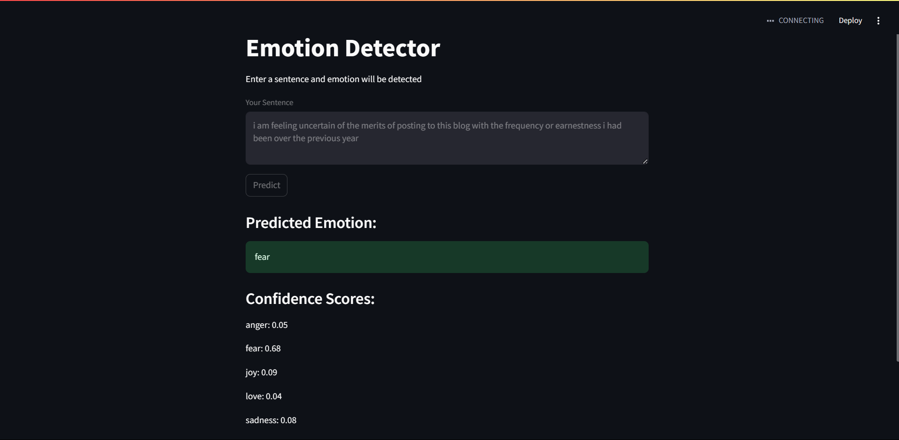

# Emotion-Detector
A very basic Logistic Regression model for emotion detection

[Dataset]([https://link-url-here.org](https://www.kaggle.com/datasets/praveengovi/emotions-dataset-for-nlp))

### Model used 
- Logistic Regression
- Accuracy - 88.3%

### UI
- streamlit

